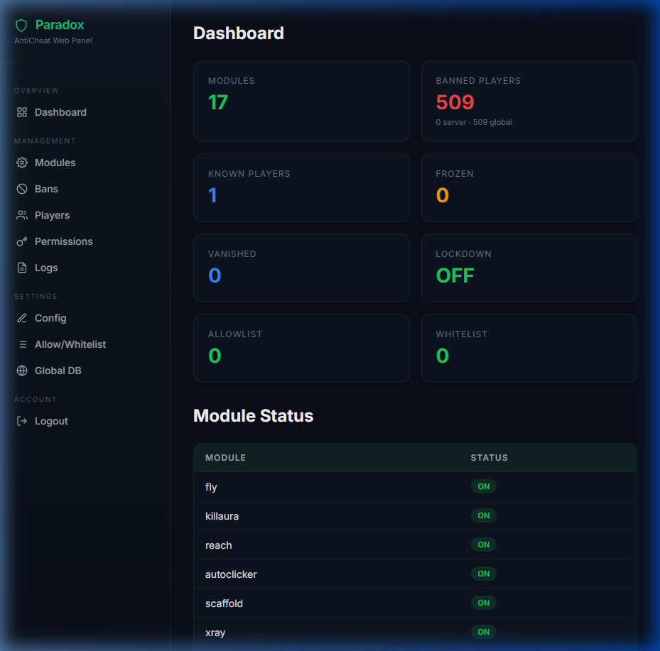
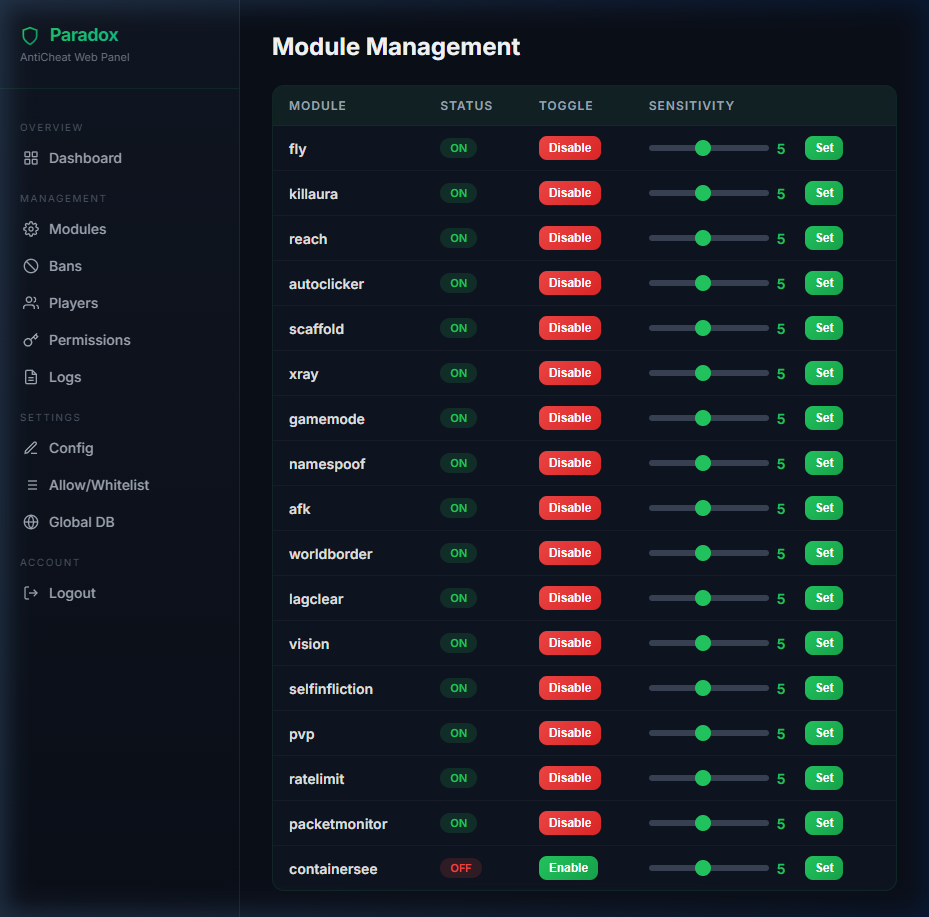
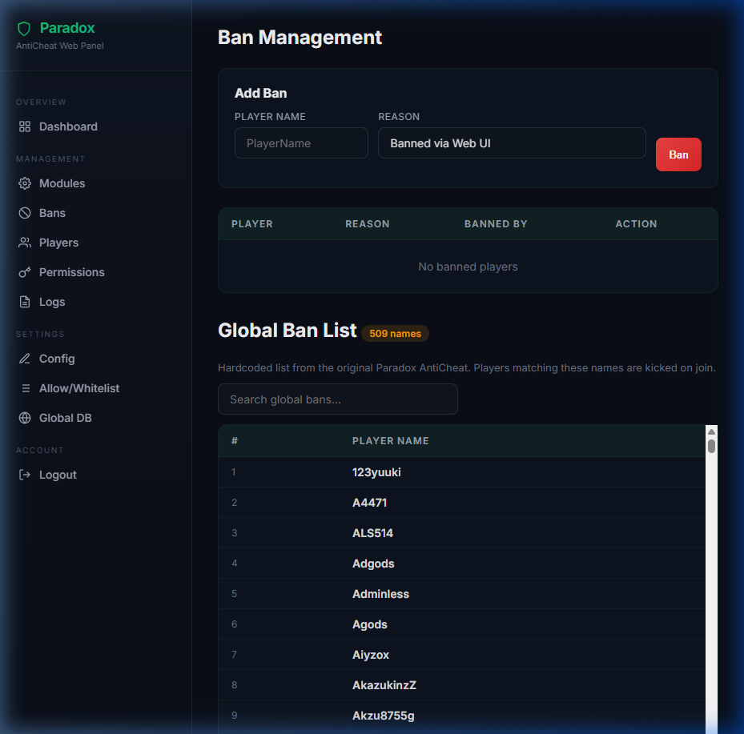

<p align="center">
  
  <h1 align="center">🛡️ Paradox AntiCheat</h1>
  <p align="center">
    A comprehensive anti-cheat and server moderation plugin for <strong>Endstone</strong> (Minecraft Bedrock Edition)
  </p>
  <p align="center">
    
    
    
    
  </p>
  <p align="center">
    <a href="https://github.com/TheNINJALLO/endstone-paradox/releases/latest">
      
    </a>
    
    <a href="https://theninjallo.github.io/endstone-paradox/">
      
    </a>
  </p>
</p>

---

> **Originally created by [Visual1mpact](https://github.com/Visual1mpact/Paradox_AntiCheat)**
> — Ported to Endstone by [**TheNINJALLO**](https://github.com/TheNINJALLO)

A full Python port of the original [Paradox AntiCheat](https://github.com/Visual1mpact/Paradox_AntiCheat), rebuilt from the ground up as a native Endstone plugin with SQLite persistence, SHA-256 authentication, protocol-level detection, and a complete in-game GUI.

---

<p align="center">
  
  
  
</p>

<details open>
<summary><h3>✅ Tier 1 — Movement, Combat & Item Protection</h3></summary>

<br>

| Feature | Status | Feature | Status |
|:--------|:------:|:--------|:------:|
| NoClip / Phase | ✅ | Anti-Knockback | ✅ |
| WaterWalk / Jesus | ✅ | Criticals Detection | ✅ |
| Step Hack | ✅ | Hit Through Walls | ✅ |
| Timer Hack | ✅ | TriggerBot | ✅ |
| Blink / Teleport | ✅ | Illegal Item Scanner | ✅ |

</details>

<details open>
<summary><h3>✅ Tier 2 — Community & Moderation — Complete</h3></summary>

<br>

| Feature | Description | Status |
|:--------|:------------|:------:|
| Discord Integration | Webhook alerts, ban notifications, colour-coded severity embeds, rate-limited background sender | ✅ |
| Chat Protection | Spam detection (flood + repeat), ad filter (IPs/URLs), swear filter, caps limiter, mute system (timed/permanent) | ✅ |
| Anti-Grief / World Protection | Anti-nuke (mass break), rapid placement detection, explosion audit logging (TNT/creeper) | ✅ |
| Evidence Replay | Ring-buffer player state recording, auto-snapshots on violations, staff review with frame-by-frame summaries | ✅ |

</details>

<details open>
<summary><h3>✅ Tier 3 — Intelligence & Analytics — Complete</h3></summary>

<br>

| Feature | Description | Status |
|:--------|:------------|:------:|
| Analytics Dashboard | Violation charts (Chart.js), module breakdown, enforcement actions doughnut, top flagged players | ✅ |
| Bot Detection | 3-layer: behavioral entropy, connection cycling, honeypot traps | ✅ |
| Player Report System | `/ac-report` command, web queue with claim/resolve, auto-escalation, rate limiting | ✅ |
| Session Fingerprinting | Device/IP/XUID composite hash, alt detection, ban evasion tracking | ✅ |
| Adaptive Check Frequency | Risk-tier-based intervals — clean players checked less, flagged players every tick | ✅ |
| Global Intelligence Network | Crowd-sourced fingerprints, telemetry, reputation scores — smarter with every server | ✅ |
| **Baseline Learning System** | Per-module EMA behavioral profiling — learns normal patterns before flagging (60-sample warmup) | ✅ |
| **Violations Management** | Clear player/all violations via web UI, configurable enforcement mode (Log Only/Soft/Hard) | ✅ |

</details>

<p align="center"><sub>📖 <a href="https://theninjallo.github.io/endstone-paradox/#/roadmap">Full roadmap with implementation details →</a></sub></p>

---

## 📋 Table of Contents

- [Roadmap](#️-development-roadmap)
- [Quick Start](#-quick-start)
- [Features](#-features)
- [Commands](#-commands)
- [GUI System](#-gui-system)
- [Configuration](#-configuration)
- [Architecture](#-architecture)
- [FAQ](#-faq)
- [License](#-license)

---

## � Quick Start

### Step 1 — Download

Grab the latest `.whl` file from the **[Releases page](https://github.com/TheNINJALLO/endstone-paradox/releases/latest)**.

### Step 2 — Install

Drop the `.whl` file into your Endstone server's `plugins/` folder:

```
your-server/
├── endstone.toml
├── plugins/
│   └── endstone_paradox-1.8.3-py3-none-any.whl   ← drop it here
└── ...
```

### Step 3 — Start the Server

Start (or restart) your Endstone server. You'll see Paradox load in the console:

```
[ParadoxAC] Paradox AntiCheat v1.8.3 loaded!
[ParadoxAC] Database initialized at plugins/ParadoxAC/paradox.db
[ParadoxAC] 46 detection modules registered.
```

### Step 4 — Set Your Admin Password

Join the server and run:

```
/ac-op YourSecretPassword
```

> **⚠️ Important:** The **first time** you run `/ac-op`, the password you type becomes your permanent admin password (hashed with SHA-256). All future `/ac-op` attempts must use this same password.

You now have **Level 4 clearance** — full admin access to all Paradox commands and the GUI.

### Step 5 — Open the GUI

```
/ac-gui
```

This opens the full admin panel where you can manage **everything** — modules, players, moderation, settings, and more — without memorizing any commands.

---

## ✨ Features

### 📊 46 Detection, Community & Admin Modules

| Module | What It Detects |
|--------|-----------------|
| **Fly** | Flight/hover hacks + **speed hacks** — surrounding-block check, velocity analysis, position-delta speed tracking (7.3 bps threshold), trident/knockback/slime/honey/gliding exemptions |
| **NoClip** | Phase/noclip hacks — ray-traces movement path through solid blocks (3 consecutive flags) |
| **WaterWalk** | Jesus hacks — standing on water without Frost Walker, ice, or lily pads (4 flags) |
| **Step Hack** | Step hacks — climbing full blocks without jumping, exempts stairs/slabs/slime (3 flags) |
| **Timer** | Timer hacks — PlayerAuthInputPacket frequency analysis (>23 pps fast, <15 pps slow, 4 windows) |
| **Blink** | Teleport/blink hacks — position jumps >10 blocks without server teleport (3s grace, 2 flags) |
| **KillAura** | Combat bots — dynamic thresholds, facing angle, attack rate + pattern, **multi-target** (>2 in 0.5s), baselines |
| **Reach** | Extended reach — Catmull-Rom cubic interpolation, latency tolerance, reach_distance baseline |
| **AutoClicker** | Click bots — per-platform CPS, air-click tracking, consistency (CV), **click_rate baseline** |
| **Anti-KB** | Anti-knockback — tracks post-hit displacement, flags if player doesn't move within 3 ticks (3 flags) |
| **Criticals** | Criticals hack — detects ground-level hits with minimal Y change (5 flags) |
| **Wall Hit** | Hit through walls — LoS ray-trace from attacker eye to victim, checks for solid blocks (3 flags) |
| **TriggerBot** | TriggerBot — rotation→attack timing <100ms consistently (4/10 in analysis window) |
| **Scaffold** | Speed bridging — air-below filtering, axis patterns, **backwards placement**, placement_rate baseline |
| **X-Ray** | Mining hacks — weighted suspicion, hidden ore, vein-jumping, ore ratios, graduated escalation |
| **GameMode** | Unauthorized gamemode changes — instant blocking |
| **Namespoof** | Name manipulation — length, character, and duplicate checks |
| **Self-Infliction** | Self-damage exploits |
| **AFK** | Idle players — position tracking with warnings before kick |
| **Vision** | Aimbot/snap aim — snap counting, **rotation acceleration**, **pre-attack snap correlation** |
| **World Border** | Border enforcement — configurable radius with teleport-back |
| **Rate Limiter** | Packet floods — automatic DoS lockdown |
| **Packet Monitor** | Packet spam — per-type frequency monitoring, **emits violations** into engine |
| **PvP Manager** | PvP system — per-player toggles, combat tagging, log detection |
| **Lag Clear** | Entity cleanup — API-based clearing, **excludes name-tagged/NPC entities**, counts cleared |
| **Illegal Items** | Illegal item scanner — enchantment levels, stack sizes, creative-only items, auto-remove |
| **Container See** | Admin tool — see player inventories and identify containers by looking (OP/L4, action bar display, off by default) |
| **Anti-Dupe** | 4-layer dupe prevention — bundle, hopper, piston, packet analysis (off by default) |
| **Crash-Drop** | Anti-crash-drop — disconnect tracking, duped entity removal (off by default) |
| **Inv-Sync** | Inventory sync — DB snapshots, detects excess items on rejoin (off by default) |
| **SkinGuard** | Skin validation — blocks 4D geometry, tiny/invisible skins, sub-pixel bone exploits |
| **Discord** | Discord webhook integration — colour-coded violation embeds, ban/kick alerts, rate-limited background sender (off by default) |
| **Chat Protection** | Chat suite — spam detection (flood + repeat), ad filter (IPs/URLs/domains), swear filter, caps limiter, mute system |
| **Anti-Grief** | World protection — anti-nuke (mass block break), rapid placement rate-limit, explosion audit logging |
| **Evidence Replay** | Forensic replay — ring-buffer player state recording, auto-snapshots on violations, frame-by-frame staff review |
| **Bot Detection** | 3-layer bot detection — behavioral entropy analysis, connection cycling detection, honeypot block traps |
| **Report System** | Player reports — `/ac-report` command, web queue with claim/resolve, auto-escalation, rate limiting |
| **Session Fingerprint** | Device fingerprinting — composite IP/OS/XUID hash, alt account detection, ban evasion tracking |
| **Adaptive Check** | Smart scheduling — risk-tier-based check intervals, clean players checked less, flagged players every tick |
| **Aimbot Monitor** | Rotation smoothing variance detection |
| **AntiCrash** | SubChunkRequest packet exploit blocking |
| **AutoTotem** | Inhuman totem replenishment detection |
| **Container Lock** | Storage block ownership locking |
| **Death Coords** | Death coordinate notification |
| **Dimension Lock** | Restricted dimension access control |
| **Pathing Monitor** | Auto-navigation and speed exploit detection |

Every module can be toggled individually via commands **or** the GUI. Advanced modules (anti-dupe, discord, etc.) are **off by default** and should be configured per-server.

#### 🎚️ Module Sensitivity

All detection modules support a **sensitivity scale from 1 to 10**:

| Sensitivity | Behavior |
|:-----------:|----------|
| **1** | Very lenient — fewer false positives, may miss subtle cheats |
| **5** | Default — balanced detection |
| **10** | Very strict — catches more, but may flag edge cases |

Adjust per module via command (`/ac-fly sensitivity 8`) or the GUI → **Modules** → select a module → **Adjust Sensitivity**.

### ⚖️ Violation Engine

All detection modules feed into a **centralized violation engine** instead of punishing directly:

| Feature | Description |
|---------|-------------|
| **Rolling buffers** | Per-player 5-minute decay window with severity scoring |
| **Enforcement ladder** | warn → cancel → setback → kick → ban (auto-escalation) |
| **3 modes** | `logonly` (monitor only), `soft` (default — cancel + setback), `hard` (faster escalation) |
| **Rate-limited alerts** | Staff get max 1 alert per player per module every 10 seconds |
| **Evidence logging** | All violations persisted to SQLite with timestamps, severity, and module |
| **Violation descriptions** | Every violation includes a plain-English `desc` explaining what triggered the detection |
| **Cross-module correlation** | Multi-module flags increase escalation speed |
| **Temporary exemptions** | Exempt specific players from specific modules for testing |
| **Live watching** | Admins can stream a player's violations in real-time |

Configure with `/ac-mode`, view evidence with `/ac-case`, watch live with `/ac-watch`.

### 🔐 4-Level Security System

| Level | Name | Access |
|-------|------|--------|
| 1 | Standard | Utility commands (home, tpr, pvp, channels) |
| 2 | Moderator | Player management (kick, freeze, warn) |
| 3 | Admin | Settings and module control |
| 4 | Owner | Full access — all commands, exempt from detection |

- **SHA-256 password hashing** — your password is never stored in plain text
- **Security broadcasts** — all admin actions are reported to Level 4 players
- **Two-tier lockdown mode:**
  - **Level 1** — Only Level 4 (Owner) can stay and use commands
  - **Level 2** — Level 4 + Level 3 (Moderator) can stay and use commands

### 💾 SQLite Persistence

Everything saves automatically and survives server restarts:

- Bans, allowlists, whitelists
- Module states (enabled/disabled)
- Player homes, ranks, channels
- Frozen/vanished player lists
- Namespoof detection logs
- Violation evidence and enforcement history
- All configuration settings

---

## 📖 Commands

### Moderation

| Command | Description |
|---------|-------------|
| `/ac-op [password]` | Authenticate to gain security clearance |
| `/ac-deop [player]` | Revoke your or another player's clearance |
| `/ac-ban <player> [reason]` | Ban a player with an optional reason |
| `/ac-unban <name>` | Unban a player by name |
| `/ac-kick <player> [reason]` | Kick a player with an optional reason |
| `/ac-freeze <player>` | Freeze or unfreeze a player in place |
| `/ac-vanish` | Toggle invisibility — hide from all players |
| `/ac-lockdown` | Toggle server lockdown |
| `/ac-lockdown level 1` | Set lockdown to Level 4 only |
| `/ac-lockdown level 2` | Set lockdown to Level 4 + Level 3 |
| `/ac-punish <player> [action]` | Punish a player (warn/mute/kick/ban) |
| `/ac-tpa <player>` | Send a teleport request |
| `/ac-allowlist [add\|remove\|list]` | Manage the allow list |
| `/ac-whitelist [add\|remove\|list]` | Manage the whitelist |
| `/ac-opsec` | View security dashboard |
| `/ac-despawn [type] [radius]` | Despawn entities by type within radius |
| `/ac-modules` | View all modules and their status |
| `/ac-spooflog` | View name spoofing logs |
| `/ac-command [enable\|disable] [cmd]` | Enable or disable a command |
| `/ac-prefix [prefix]` | Change the chat prefix |

### Violation Engine

| Command | Description |
|---------|-------------|
| `/ac-case <player> [count]` | View last N violation entries for a player |
| `/ac-watch <player> [minutes]` | Stream a player's violations in real-time |
| `/ac-watch stop` | Stop watching |
| `/ac-mode <logonly\|soft\|hard>` | Set enforcement mode (L4 only) |
| `/ac-exempt <player> <module\|all> [min]` | Temporarily exempt a player from detection |

### Detection Toggles

| Command | Description |
|---------|-------------|
| `/ac-fly` | Toggle fly/hover detection |
| `/ac-fly sensitivity 7` | Set fly detection sensitivity (1-10) |
| `/ac-killaura` | Toggle kill aura detection |
| `/ac-reach` | Toggle reach hack detection |
| `/ac-autoclicker [maxcps]` | Toggle autoclicker detection (optionally set max CPS) |
| `/ac-scaffold` | Toggle scaffold detection |
| `/ac-xray` | Toggle X-ray detection |
| `/ac-gamemode` | Toggle gamemode change detection |
| `/ac-afk [timeout]` | Toggle AFK detection (optionally set timeout) |
| `/ac-vision` | Toggle aimbot/snap detection |
| `/ac-worldborder [radius] [x] [z]` | Set world border radius and center |
| `/ac-lagclear [interval]` | Toggle lag clear (optionally set interval) |
| `/ac-ratelimit` | Toggle packet rate limiting |
| `/ac-namespoof` | Toggle name spoofing detection |
| `/ac-packetmonitor` | Toggle packet spam monitoring |
| `/ac-containersee` | Toggle container vision for admins (off by default) |
| `/ac-skinguard` | Toggle skin validation (4D/tiny/invisible skin detection) |

> **Tip:** Any detection command accepts `sensitivity N` — e.g., `/ac-killaura sensitivity 3` for lenient or `/ac-xray sensitivity 9` for strict.

### Utility

| Command | Description |
|---------|-------------|
| `/ac-home [set\|delete\|list\|help] [name]` | Manage home locations (max 5 per player) |
| `/ac-tpr [radius]` | Teleport to a random location |
| `/ac-pvp [global\|status\|help]` | Toggle PvP (personal or global) |
| `/ac-channels [create\|join\|leave\|list\|send]` | Private chat channels |
| `/ac-invsee <player>` | View a player's inventory |
| `/ac-rank <player> [rank]` | Set or view a player's display rank |
| `/ac-debug-db [table] [key]` | Inspect the database directly |
| `/ac-gui` | Open the full admin GUI |
| `/ac-about` | View plugin version and info |
| `/ac-report <player> [reason]` | Report a player (available to all) |

---

## 🖥️ GUI System

Type `/ac-gui` to open the complete admin panel. **Every feature is accessible from here** — you never need to memorize a command.

### Main Menu

```
┌──────────────────────────────────┐
│     🛡️ Paradox AntiCheat         │
│──────────────────────────────────│
│  ✅ Modules        │  ⚔️ Moderation │
│  👥 Players        │  🔧 Utilities   │
│  🔒 Security       │  ⚙️ Settings    │
│  📋 Commands       │  💾 Database    │
└──────────────────────────────────┘
```

| Section | What You Can Do |
|---------|-----------------|
| **Modules** | Toggle all 46 detection/admin modules on/off, adjust sensitivity for detection modules with a slider (1-10) |
| **Moderation** | Vanish, lockdown, lockdown level selector (L4 only / L4+L3), kick, ban, unban, freeze, punish, despawn entities, manage allow/white lists, view spoof logs, change prefix |
| **Players** | Select any online player → kick, ban, freeze, warn, teleport to/from them, set rank, view inventory — all from one screen |
| **Utilities** | Homes (set, delete, update, teleport), random TP, PvP toggle (personal + global), chat channels (create, join, leave, send), TPA, ranks |
| **Security** | Live dashboard: lockdown status, frozen/vanished/banned counts, per-player clearance levels, opsec report |
| **Settings** | Lockdown toggle, AFK timeout, lagclear interval, max CPS, world border radius, global PvP — all in one form |
| **Commands** | Enable/disable any of the 31 commands — see status at a glance |
| **Database** | Browse all database tables, inspect entries |

---

## ⚙️ Configuration

Settings are managed through commands, the GUI, or directly via the database.

### Key Settings

| Setting | Default | How to Change |
|---------|---------|---------------|
| AFK Timeout | 600 sec | `/ac-afk 300` or GUI → Settings |
| Lag Clear Interval | 300 sec | `/ac-lagclear 120` or GUI → Settings |
| Max CPS | 20 | `/ac-autoclicker 25` or GUI → Settings |
| World Border Radius | 10000 | `/ac-worldborder 5000` or GUI → Settings |
| Global PvP | Enabled | `/ac-pvp global` or GUI → Settings |
| Module Sensitivity | 5 (per module) | `/ac-fly sensitivity 8` or GUI → Modules → module → Sensitivity |
| Lockdown Level | 1 (L4 only) | `/ac-lockdown level 2` or GUI → Moderation → Lockdown Level |

### Database Location

```
plugins/ParadoxAC/paradox.db
```

### Config File

A `config.toml` is auto-generated in the data folder on first run:

```toml
[web_ui]
enabled = true
port = 8080
host = "0.0.0.0"
secret_key = "<auto-generated>"

[database]
mode = "internal"        # "internal" (SQLite) or "external" (MySQL/PostgreSQL)

[database.external]
type = "mysql"
host = "localhost"
port = 3306
name = "paradox"
user = "paradox"
password = ""

[global_database]          # Cross-server global ban/flag sharing
enabled = false
api_url = ""               # URL of your Paradox Global Ban API instance
api_key = ""               # Server API key from registration
sync_interval = 300        # Sync every 5 minutes
share_fingerprints = true  # Push fingerprint hashes to the Intelligence Network
share_telemetry = true     # Push violation/behavioral stats to the network
auto_tune = false          # Auto-apply crowd-sourced detection thresholds
```

---

## 🌐 Web UI Companion

Paradox includes a built-in web admin panel accessible from any browser.

### Setup

1. Start the server — web UI auto-starts on port **8080**
2. Open `http://your-server-ip:8080`
3. Login with the **secret key** from `config.toml`

### Screenshots

| Dashboard | Module Management |
|:---------:|:-----------------:|
|  |  |

| Ban Management |
|:--------------:|
|  |

### Pages

| Page | What You Can Do |
|------|-----------------|
| **Dashboard** | Overview cards: module count, bans (server + 509 global), frozen, vanished, lockdown status, module status table |
| **Modules** | Two sections: **Detection Modules** (toggle + sensitivity sliders) and **Server Features** (toggle only). Card-based layout |
| **Bans** | View server bans, add/remove bans, browse the 509-name Global Ban List with search |
| **Players** | Player records, warnings, frozen/vanished lists, ranks |
| **Permissions** | View and set player clearance levels (1-4) |
| **Logs** | Namespoof detection log, detection events |
| **Analytics** | Violation time-series chart, module breakdown, enforcement doughnut, summary stats |
| **Violations** | Per-player violation history with human-readable descriptions, severity filters, evidence details |
| **Reports** | Player report queue with claim/resolve, status filters, priority badges |
| **Config** | Edit all DB settings, view config.toml, database mode info |
| **Allow/Whitelist** | Add/remove players from allowlist and whitelist |
| **Global DB** | Cross-server ban database — configure the [Paradox Global Ban API](https://github.com/TheNINJALLO/endstone-paradox) |

### Database Modes

| Mode | Backend | Use Case |
|------|---------|----------|
| `internal` | SQLite (default) | Single server, zero setup |
| `external` | MySQL / PostgreSQL | Multi-server or remote panel |

### Global Ban List

Paradox ships with a **hardcoded list of 509 known cheaters** from the [original Paradox AntiCheat](https://github.com/Visual1mpact/Paradox_AntiCheat). Players matching these names are automatically kicked on join.

### 🌍 Global Ban Database (Cross-Server)

Every Paradox install automatically connects to the **Global Ban API** — a shared database for bans, high-risk flags, and violation reports across all servers running the plugin.

| Feature | Details |
|---------|---------|
| **Zero Config** | Works out of the box — auto-registers on first startup |
| **Ban Sharing** | `/ac-ban` on any server → player blocked on ALL servers |
| **Auto-Ban Sharing** | Violation engine auto-bans also push globally |
| **Violation Reports** | All detections (fly, killaura, xray, etc.) reported for cross-server intelligence |
| **3 Categories** | `ban` (kicked everywhere), `high_risk` (staff alerted), `flagged` (staff alerted) |
| **5-Minute Sync** | New bans/flags pulled every 5 minutes from the API |
| **Self-Hosted Option** | Run your own API for private server networks |

To opt out: set `global_database.enabled = false` in `config.toml`.

### 🧠 Global Intelligence Network

Beyond bans, the Global API powers a **crowd-sourced intelligence network** where every Paradox server contributes anonymized behavioral data — the more servers participate, the smarter detection becomes.

| Feature | Details |
|---------|---------|
| **Fingerprint Sharing** | Session fingerprints (hashed, no PII) shared across servers for cross-server alt/evasion detection |
| **Behavioral Telemetry** | V  iolation rates, risk tier distributions, enforcement outcomes pushed to the network |
| **Crowd-Sourced Thresholds** | Network recommends sensitivity values based on aggregate data from all servers |
| **Reputation Scores** | Per-fingerprint scores (0-100) calculated from cross-server violation history |
| **Auto-Tune** | Optionally auto-apply crowd-sourced thresholds (`auto_tune = true`) |
| **Graceful Degradation** | Works without new API endpoints — silently skips if not supported |

### 📊 Player Baseline Profiling

Every player builds an **individual behavioral baseline** using Exponential Moving Averages (EMA). Modules record metrics during normal play, and deviations from a player’s own rolling average trigger escalated alerts — catching subtle cheats that pass fixed thresholds.

| Feature | Details |
|---------|---------|
| **EMA Tracker** | Efficient O(1) per-sample rolling average + variance |
| **Z-Score Detection** | Flags when current value > 2.5σ from player’s own norm |
| **Warmup Period** | First 30 samples build baseline without false positives |
| **Dual-Layer** | Baseline + fixed thresholds = two independent detection layers |
| **Persistent** | Baselines save to DB across sessions |

**Tracked Metrics:**

| Module | Metric | What It Learns |
|--------|--------|---------|
| Fly | `fly.h_speed`, `fly.hover_time`, `fly.ground_speed` | Player's normal horizontal speed, airtime, and ground movement |
| KillAura | `combat.attack_rate`, `combat.hit_angle`, `combat.timing_variance` | Player's typical attack speed, aim precision, and click timing patterns |
| Reach | `combat.reach_distance` | Player's normal hit distance |
| AutoClicker | `combat.click_rate` | Player's normal CPS for their platform |
| Scaffold | `build.placement_rate` | Player's normal block placement speed |
| X-Ray | `mining.ore_ratio`, `mining.vein_jump_dist` | Player's mining patterns |

---

## 🏗️ Architecture

```
endstone-paradox/
├── pyproject.toml              # Build configuration
├── README.md
└── src/endstone_paradox/
    ├── __init__.py
    ├── paradox.py              # Main plugin (35+ commands, event handlers)
    ├── database.py             # SQLite persistence (WAL mode)
    ├── security.py             # 4-level clearance + SHA-256 auth
    ├── core/                   # Centralized systems
    │   ├── violation_engine.py #   Violation processing pipeline (290 lines)
    │   └── player_baseline.py  #   EMA behavioral profiling per player
    ├── modules/                # 46 detection, community & admin modules
    │   ├── base.py             #   Abstract base class + sensitivity + emit()
    │   ├── aimbot_monitor.py   #   Rotation smoothing variance detection
    │   ├── anticrash.py        #   SubChunkRequest packet exploit blocking
    │   ├── autototem.py        #   Inhuman totem replenishment detection
    │   ├── container_lock.py   #   Storage block ownership locking
    │   ├── death_coords.py     #   Death coordinate notification
    │   ├── dimension_lock.py   #   Restricted dimension access control
    │   ├── pathing_monitor.py  #   Auto-navigation and speed exploit detection
    │   ├── fly.py              #   Flight/hover (surrounding-block check, knockback/slime exemptions)
    │   ├── noclip.py           #   Phase through solid blocks (ray-trace)
    │   ├── waterwalk.py        #   Jesus hack (Frost Walker/ice/lily exemptions)
    │   ├── stephack.py         #   Step up blocks without jumping
    │   ├── timer.py            #   Game speed manipulation (packet frequency)
    │   ├── blink.py            #   Instant teleport/position jumps
    │   ├── killaura.py         #   Combat bot (dynamic thresholds, latency tolerance)
    │   ├── reach.py            #   Reach hack (Catmull-Rom interpolation, latency tolerance)
    │   ├── autoclicker.py      #   CPS tracking (PC/Mobile/Console, air-click, CV analysis)
    │   ├── antikb.py           #   Anti-knockback (post-hit displacement)
    │   ├── criticals.py        #   Always-critical hit exploits
    │   ├── wallhit.py          #   Hitting through solid blocks (LoS ray-trace)
    │   ├── triggerbot.py       #   Auto-attack on target acquisition
    │   ├── scaffold.py         #   Speed bridge (air-below filtering)
    │   ├── xray.py             #   X-ray (weighted suspicion scoring)
    │   ├── gamemode.py         #   Gamemode change blocking
    │   ├── namespoof.py        #   Name validation
    │   ├── self_infliction.py  #   Self-damage detection
    │   ├── afk.py              #   AFK idle tracking
    │   ├── vision.py           #   Aimbot detection
    │   ├── skinguard.py        #   4D/tiny/invisible skin detection
    │   ├── illegal_items.py    #   Illegal item scanner (enchants, stacks)
    │   ├── discord_webhook.py  #   Discord webhook (violations, bans, kicks)
    │   ├── chat_protection.py  #   Spam/ad/swear filter + mute system
    │   ├── antigrief.py        #   Anti-nuke, rapid placement, explosion logging
    │   ├── evidence_replay.py  #   Ring-buffer recording + violation snapshots
    │   ├── world_border.py     #   Border enforcement
    │   ├── lag_clear.py        #   Entity cleanup
    │   ├── rate_limit.py       #   Packet flood detection
    │   ├── packet_monitor.py   #   Packet spam alerts
    │   ├── pvp_manager.py      #   PvP toggle system
    │   ├── containersee.py     #   Container/inventory vision (admin)
    │   ├── antidupe.py         #   4-layer dupe prevention
    │   ├── crashdrop.py        #   Anti-crash-drop
    │   ├── invsync.py          #   Inventory sync
    │   ├── bot_detection.py    #   3-layer bot detection (entropy, cycling, honeypots)
    │   ├── report_system.py    #   Player report queue + auto-escalation
    │   ├── session_fingerprint.py #   Device fingerprinting + alt detection
    │   └── adaptive_check.py   #   Risk-tier check interval optimizer
    ├── commands/
    │   ├── moderation/         # 18 admin/moderation commands
    │   ├── settings/           # Module toggle handler
    │   └── utility/            # 10 utility commands (incl. /ac-report)
    ├── gui/
    │   └── form_generator.py   # Full GUI (8 sections, 700+ lines)
    ├── core/                   # Centralized systems
    │   ├── violation_engine.py #   Violation processing pipeline (290 lines)
    │   ├── player_baseline.py  #   EMA behavioral profiling per player
    │   └── analytics_collector.py #   Hourly violation data aggregations from original Paradox
    ├── global_api.py           # Global Ban API + Intelligence Network client
    └── web/                    # Built-in web admin panel
        └── server.py           # Flask server + all routes + embedded templates
```

---

## ❓ FAQ

<details>
<summary><strong>How do I set up admin access for the first time?</strong></summary>

Join the server and type `/ac-op YourPassword`. The first password you use becomes the permanent admin password. You'll get Level 4 clearance (full access). To give other players admin, share the password — they can use `/ac-op` with it too.
</details>

<details>
<summary><strong>Can I use the GUI for everything?</strong></summary>

Yes! Type `/ac-gui` and you have full access to every feature. You can toggle modules, kick/ban/freeze players, manage homes, toggle PvP, manage channels, change settings, enable/disable commands, and browse the database — all without typing a single command.
</details>

<details>
<summary><strong>How do I disable a specific detection module?</strong></summary>

Either use the command (e.g., `/ac-fly` to toggle fly detection) or open `/ac-gui` → **Modules** and tap the module to toggle it.
</details>

<details>
<summary><strong>How do I reset my admin password?</strong></summary>

Delete the `security` table entry in the database. You can use `/ac-debug-db security password` to inspect it, then restart the server and run `/ac-op NewPassword` to set a fresh password.
</details>

<details>
<summary><strong>How do homes work?</strong></summary>

Each player can save up to 5 homes. Use `/ac-home set MyBase` to save your location, `/ac-home MyBase` to teleport back, `/ac-home list` to see all homes, and `/ac-home delete MyBase` to remove one. Or use `/ac-gui` → **Utilities** → **Homes** for a visual interface.
</details>

<details>
<summary><strong>What happens during a lockdown?</strong></summary>

When lockdown is active (`/ac-lockdown` or via GUI), access is restricted based on the lockdown level:
- **Level 1** (default): Only Level 4 (Owner) can use commands and stay on the server.
- **Level 2**: Level 4 + Level 3 (Moderator) can stay and use commands.

Set the level with `/ac-lockdown level 2` or via GUI → **Moderation** → **Lockdown Level**.
</details>

---

## 📄 License

GPL-3.0 — see [LICENSE](LICENSE) for details. Originally licensed under GPL-3.0 by [Visual1mpact](https://github.com/Visual1mpact/Paradox_AntiCheat).

---

<p align="center">
  <sub>Made with ❤️ by <a href="https://github.com/TheNINJALLO">TheNINJALLO</a> — based on <a href="https://github.com/Visual1mpact/Paradox_AntiCheat">Paradox AntiCheat</a> by Visual1mpact</sub>
</p>
